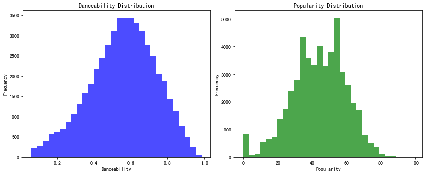
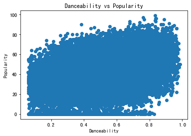

```python
import numpy as np
import pandas as pd

from sklearn.model_selection import train_test_split
from sklearn.preprocessing import StandardScaler,RobustScaler
from sklearn.linear_model import LogisticRegression
from sklearn.neighbors import KNeighborsClassifier
from sklearn.tree import DecisionTreeClassifier
from sklearn.svm import LinearSVC, SVC
from sklearn.neural_network import MLPClassifier
from sklearn.ensemble import RandomForestClassifier, GradientBoostingClassifier
from sklearn.ensemble import BaggingClassifier

from sklearn.model_selection import GridSearchCV
from sklearn.model_selection import cross_val_score
from sklearn.model_selection import cross_val_predict
from sklearn.model_selection import StratifiedKFold
from sklearn.ensemble import VotingClassifier
from sklearn.metrics import mean_squared_error

import seaborn as sns
import matplotlib.pyplot as plt
import warnings
warnings.filterwarnings('ignore')
```


```python
data = pd.read_csv('music_genre.csv')
data
```


<div>
<style scoped>
    .dataframe tbody tr th:only-of-type {
        vertical-align: middle;
    }

    .dataframe tbody tr th {
        vertical-align: top;
    }

    .dataframe thead th {
        text-align: right;
    }
</style>
<table border="1" class="dataframe">
  <thead>
    <tr style="text-align: right;">
      <th></th>
      <th>instance_id</th>
      <th>artist_name</th>
      <th>track_name</th>
      <th>popularity</th>
      <th>acousticness</th>
      <th>danceability</th>
      <th>duration_ms</th>
      <th>energy</th>
      <th>instrumentalness</th>
      <th>key</th>
      <th>liveness</th>
      <th>loudness</th>
      <th>mode</th>
      <th>speechiness</th>
      <th>tempo</th>
      <th>obtained_date</th>
      <th>valence</th>
      <th>music_genre</th>
    </tr>
  </thead>
  <tbody>
    <tr>
      <th>0</th>
      <td>32894.0</td>
      <td>Röyksopp</td>
      <td>Röyksopp's Night Out</td>
      <td>27.0</td>
      <td>0.00468</td>
      <td>0.652</td>
      <td>-1.0</td>
      <td>0.941</td>
      <td>0.79200</td>
      <td>A#</td>
      <td>0.115</td>
      <td>-5.201</td>
      <td>Minor</td>
      <td>0.0748</td>
      <td>100.889</td>
      <td>4-Apr</td>
      <td>0.759</td>
      <td>Electronic</td>
    </tr>
    <tr>
      <th>1</th>
      <td>46652.0</td>
      <td>Thievery Corporation</td>
      <td>The Shining Path</td>
      <td>31.0</td>
      <td>0.01270</td>
      <td>0.622</td>
      <td>218293.0</td>
      <td>0.890</td>
      <td>0.95000</td>
      <td>D</td>
      <td>0.124</td>
      <td>-7.043</td>
      <td>Minor</td>
      <td>0.0300</td>
      <td>115.00200000000001</td>
      <td>4-Apr</td>
      <td>0.531</td>
      <td>Electronic</td>
    </tr>
    <tr>
      <th>2</th>
      <td>30097.0</td>
      <td>Dillon Francis</td>
      <td>Hurricane</td>
      <td>28.0</td>
      <td>0.00306</td>
      <td>0.620</td>
      <td>215613.0</td>
      <td>0.755</td>
      <td>0.01180</td>
      <td>G#</td>
      <td>0.534</td>
      <td>-4.617</td>
      <td>Major</td>
      <td>0.0345</td>
      <td>127.994</td>
      <td>4-Apr</td>
      <td>0.333</td>
      <td>Electronic</td>
    </tr>
    <tr>
      <th>3</th>
      <td>62177.0</td>
      <td>Dubloadz</td>
      <td>Nitro</td>
      <td>34.0</td>
      <td>0.02540</td>
      <td>0.774</td>
      <td>166875.0</td>
      <td>0.700</td>
      <td>0.00253</td>
      <td>C#</td>
      <td>0.157</td>
      <td>-4.498</td>
      <td>Major</td>
      <td>0.2390</td>
      <td>128.014</td>
      <td>4-Apr</td>
      <td>0.270</td>
      <td>Electronic</td>
    </tr>
    <tr>
      <th>4</th>
      <td>24907.0</td>
      <td>What So Not</td>
      <td>Divide &amp; Conquer</td>
      <td>32.0</td>
      <td>0.00465</td>
      <td>0.638</td>
      <td>222369.0</td>
      <td>0.587</td>
      <td>0.90900</td>
      <td>F#</td>
      <td>0.157</td>
      <td>-6.266</td>
      <td>Major</td>
      <td>0.0413</td>
      <td>145.036</td>
      <td>4-Apr</td>
      <td>0.323</td>
      <td>Electronic</td>
    </tr>
    <tr>
      <th>...</th>
      <td>...</td>
      <td>...</td>
      <td>...</td>
      <td>...</td>
      <td>...</td>
      <td>...</td>
      <td>...</td>
      <td>...</td>
      <td>...</td>
      <td>...</td>
      <td>...</td>
      <td>...</td>
      <td>...</td>
      <td>...</td>
      <td>...</td>
      <td>...</td>
      <td>...</td>
      <td>...</td>
    </tr>
    <tr>
      <th>50000</th>
      <td>58878.0</td>
      <td>BEXEY</td>
      <td>GO GETTA</td>
      <td>59.0</td>
      <td>0.03340</td>
      <td>0.913</td>
      <td>-1.0</td>
      <td>0.574</td>
      <td>0.00000</td>
      <td>C#</td>
      <td>0.119</td>
      <td>-7.022</td>
      <td>Major</td>
      <td>0.2980</td>
      <td>98.02799999999999</td>
      <td>4-Apr</td>
      <td>0.330</td>
      <td>Hip-Hop</td>
    </tr>
    <tr>
      <th>50001</th>
      <td>43557.0</td>
      <td>Roy Woods</td>
      <td>Drama (feat. Drake)</td>
      <td>72.0</td>
      <td>0.15700</td>
      <td>0.709</td>
      <td>251860.0</td>
      <td>0.362</td>
      <td>0.00000</td>
      <td>B</td>
      <td>0.109</td>
      <td>-9.814</td>
      <td>Major</td>
      <td>0.0550</td>
      <td>122.04299999999999</td>
      <td>4-Apr</td>
      <td>0.113</td>
      <td>Hip-Hop</td>
    </tr>
    <tr>
      <th>50002</th>
      <td>39767.0</td>
      <td>Berner</td>
      <td>Lovin' Me (feat. Smiggz)</td>
      <td>51.0</td>
      <td>0.00597</td>
      <td>0.693</td>
      <td>189483.0</td>
      <td>0.763</td>
      <td>0.00000</td>
      <td>D</td>
      <td>0.143</td>
      <td>-5.443</td>
      <td>Major</td>
      <td>0.1460</td>
      <td>131.079</td>
      <td>4-Apr</td>
      <td>0.395</td>
      <td>Hip-Hop</td>
    </tr>
    <tr>
      <th>50003</th>
      <td>57944.0</td>
      <td>The-Dream</td>
      <td>Shawty Is Da Shit</td>
      <td>65.0</td>
      <td>0.08310</td>
      <td>0.782</td>
      <td>262773.0</td>
      <td>0.472</td>
      <td>0.00000</td>
      <td>G</td>
      <td>0.106</td>
      <td>-5.016</td>
      <td>Minor</td>
      <td>0.0441</td>
      <td>75.88600000000001</td>
      <td>4-Apr</td>
      <td>0.354</td>
      <td>Hip-Hop</td>
    </tr>
    <tr>
      <th>50004</th>
      <td>63470.0</td>
      <td>Naughty By Nature</td>
      <td>Hip Hop Hooray</td>
      <td>67.0</td>
      <td>0.10200</td>
      <td>0.862</td>
      <td>267267.0</td>
      <td>0.642</td>
      <td>0.00000</td>
      <td>F#</td>
      <td>0.272</td>
      <td>-13.652</td>
      <td>Minor</td>
      <td>0.1010</td>
      <td>99.20100000000001</td>
      <td>4-Apr</td>
      <td>0.765</td>
      <td>Hip-Hop</td>
    </tr>
  </tbody>
</table>
<p>50005 rows × 18 columns</p>
</div>


```python
data = data.dropna(axis=0)
data
```


<div>
<style scoped>
    .dataframe tbody tr th:only-of-type {
        vertical-align: middle;
    }

    .dataframe tbody tr th {
        vertical-align: top;
    }

    .dataframe thead th {
        text-align: right;
    }
</style>
<table border="1" class="dataframe">
  <thead>
    <tr style="text-align: right;">
      <th></th>
      <th>instance_id</th>
      <th>artist_name</th>
      <th>track_name</th>
      <th>popularity</th>
      <th>acousticness</th>
      <th>danceability</th>
      <th>duration_ms</th>
      <th>energy</th>
      <th>instrumentalness</th>
      <th>key</th>
      <th>liveness</th>
      <th>loudness</th>
      <th>mode</th>
      <th>speechiness</th>
      <th>tempo</th>
      <th>obtained_date</th>
      <th>valence</th>
      <th>music_genre</th>
    </tr>
  </thead>
  <tbody>
    <tr>
      <th>0</th>
      <td>32894.0</td>
      <td>Röyksopp</td>
      <td>Röyksopp's Night Out</td>
      <td>27.0</td>
      <td>0.00468</td>
      <td>0.652</td>
      <td>-1.0</td>
      <td>0.941</td>
      <td>0.79200</td>
      <td>A#</td>
      <td>0.115</td>
      <td>-5.201</td>
      <td>Minor</td>
      <td>0.0748</td>
      <td>100.889</td>
      <td>4-Apr</td>
      <td>0.759</td>
      <td>Electronic</td>
    </tr>
    <tr>
      <th>1</th>
      <td>46652.0</td>
      <td>Thievery Corporation</td>
      <td>The Shining Path</td>
      <td>31.0</td>
      <td>0.01270</td>
      <td>0.622</td>
      <td>218293.0</td>
      <td>0.890</td>
      <td>0.95000</td>
      <td>D</td>
      <td>0.124</td>
      <td>-7.043</td>
      <td>Minor</td>
      <td>0.0300</td>
      <td>115.00200000000001</td>
      <td>4-Apr</td>
      <td>0.531</td>
      <td>Electronic</td>
    </tr>
    <tr>
      <th>2</th>
      <td>30097.0</td>
      <td>Dillon Francis</td>
      <td>Hurricane</td>
      <td>28.0</td>
      <td>0.00306</td>
      <td>0.620</td>
      <td>215613.0</td>
      <td>0.755</td>
      <td>0.01180</td>
      <td>G#</td>
      <td>0.534</td>
      <td>-4.617</td>
      <td>Major</td>
      <td>0.0345</td>
      <td>127.994</td>
      <td>4-Apr</td>
      <td>0.333</td>
      <td>Electronic</td>
    </tr>
    <tr>
      <th>3</th>
      <td>62177.0</td>
      <td>Dubloadz</td>
      <td>Nitro</td>
      <td>34.0</td>
      <td>0.02540</td>
      <td>0.774</td>
      <td>166875.0</td>
      <td>0.700</td>
      <td>0.00253</td>
      <td>C#</td>
      <td>0.157</td>
      <td>-4.498</td>
      <td>Major</td>
      <td>0.2390</td>
      <td>128.014</td>
      <td>4-Apr</td>
      <td>0.270</td>
      <td>Electronic</td>
    </tr>
    <tr>
      <th>4</th>
      <td>24907.0</td>
      <td>What So Not</td>
      <td>Divide &amp; Conquer</td>
      <td>32.0</td>
      <td>0.00465</td>
      <td>0.638</td>
      <td>222369.0</td>
      <td>0.587</td>
      <td>0.90900</td>
      <td>F#</td>
      <td>0.157</td>
      <td>-6.266</td>
      <td>Major</td>
      <td>0.0413</td>
      <td>145.036</td>
      <td>4-Apr</td>
      <td>0.323</td>
      <td>Electronic</td>
    </tr>
    <tr>
      <th>...</th>
      <td>...</td>
      <td>...</td>
      <td>...</td>
      <td>...</td>
      <td>...</td>
      <td>...</td>
      <td>...</td>
      <td>...</td>
      <td>...</td>
      <td>...</td>
      <td>...</td>
      <td>...</td>
      <td>...</td>
      <td>...</td>
      <td>...</td>
      <td>...</td>
      <td>...</td>
      <td>...</td>
    </tr>
    <tr>
      <th>50000</th>
      <td>58878.0</td>
      <td>BEXEY</td>
      <td>GO GETTA</td>
      <td>59.0</td>
      <td>0.03340</td>
      <td>0.913</td>
      <td>-1.0</td>
      <td>0.574</td>
      <td>0.00000</td>
      <td>C#</td>
      <td>0.119</td>
      <td>-7.022</td>
      <td>Major</td>
      <td>0.2980</td>
      <td>98.02799999999999</td>
      <td>4-Apr</td>
      <td>0.330</td>
      <td>Hip-Hop</td>
    </tr>
    <tr>
      <th>50001</th>
      <td>43557.0</td>
      <td>Roy Woods</td>
      <td>Drama (feat. Drake)</td>
      <td>72.0</td>
      <td>0.15700</td>
      <td>0.709</td>
      <td>251860.0</td>
      <td>0.362</td>
      <td>0.00000</td>
      <td>B</td>
      <td>0.109</td>
      <td>-9.814</td>
      <td>Major</td>
      <td>0.0550</td>
      <td>122.04299999999999</td>
      <td>4-Apr</td>
      <td>0.113</td>
      <td>Hip-Hop</td>
    </tr>
    <tr>
      <th>50002</th>
      <td>39767.0</td>
      <td>Berner</td>
      <td>Lovin' Me (feat. Smiggz)</td>
      <td>51.0</td>
      <td>0.00597</td>
      <td>0.693</td>
      <td>189483.0</td>
      <td>0.763</td>
      <td>0.00000</td>
      <td>D</td>
      <td>0.143</td>
      <td>-5.443</td>
      <td>Major</td>
      <td>0.1460</td>
      <td>131.079</td>
      <td>4-Apr</td>
      <td>0.395</td>
      <td>Hip-Hop</td>
    </tr>
    <tr>
      <th>50003</th>
      <td>57944.0</td>
      <td>The-Dream</td>
      <td>Shawty Is Da Shit</td>
      <td>65.0</td>
      <td>0.08310</td>
      <td>0.782</td>
      <td>262773.0</td>
      <td>0.472</td>
      <td>0.00000</td>
      <td>G</td>
      <td>0.106</td>
      <td>-5.016</td>
      <td>Minor</td>
      <td>0.0441</td>
      <td>75.88600000000001</td>
      <td>4-Apr</td>
      <td>0.354</td>
      <td>Hip-Hop</td>
    </tr>
    <tr>
      <th>50004</th>
      <td>63470.0</td>
      <td>Naughty By Nature</td>
      <td>Hip Hop Hooray</td>
      <td>67.0</td>
      <td>0.10200</td>
      <td>0.862</td>
      <td>267267.0</td>
      <td>0.642</td>
      <td>0.00000</td>
      <td>F#</td>
      <td>0.272</td>
      <td>-13.652</td>
      <td>Minor</td>
      <td>0.1010</td>
      <td>99.20100000000001</td>
      <td>4-Apr</td>
      <td>0.765</td>
      <td>Hip-Hop</td>
    </tr>
  </tbody>
</table>
<p>50000 rows × 18 columns</p>
</div>


```python
fig, axs = plt.subplots(1, 2, figsize=(12, 5))

axs[0].hist(data['danceability'], bins=30, color='blue', alpha=0.7)
axs[0].set_title('Danceability Distribution')
axs[0].set_xlabel('Danceability')
axs[0].set_ylabel('Frequency')

axs[1].hist(data['popularity'], bins=30, color='green', alpha=0.7)
axs[1].set_title('Popularity Distribution')
axs[1].set_xlabel('Popularity')
axs[1].set_ylabel('Frequency')

plt.tight_layout()

plt.show()
```


    

    


```python
plt.scatter(data['danceability'], data['popularity'])

plt.title('Danceability vs Popularity')
plt.xlabel('Danceability')
plt.ylabel('Popularity')

plt.show()
```


    

    


```python
class KNN:
    def __init__(self, k=3):
        self.k = k
        self.X_train = None
        self.y_train = None

    def fit(self, X_train, y_train):
        self.X_train = X_train
        self.y_train = y_train

    def predict(self, X_test):
        y_pred = [self._predict(x) for x in X_test]
        return np.array(y_pred)

    def _predict(self, x):
        distances = [np.sqrt(np.sum((x - x_train)**2)) for x_train in self.X_train]
        
        k_indices = np.argsort(distances)[:self.k]
        
        k_nearest_labels = [self.y_train[i] for i in k_indices]
        
        most_common = np.bincount(k_nearest_labels).argmax()
        return most_common
```


```python

```


```python

```
